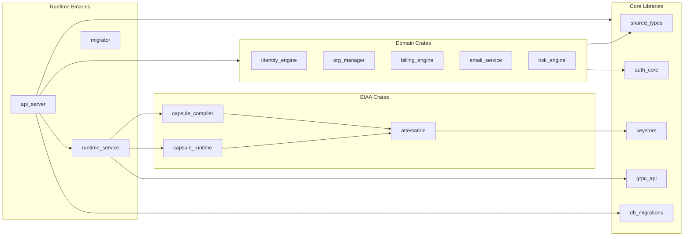
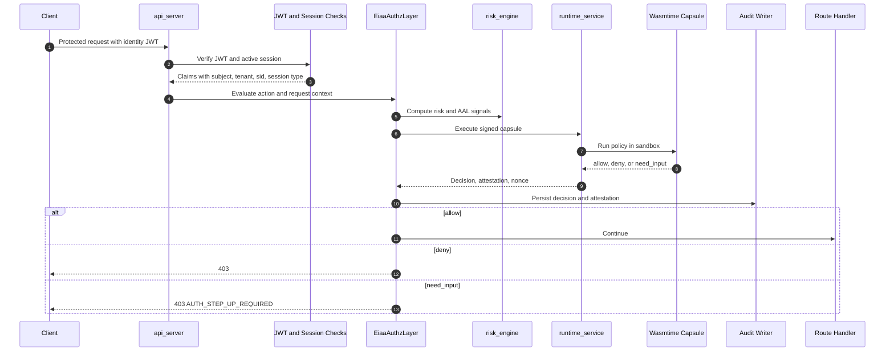
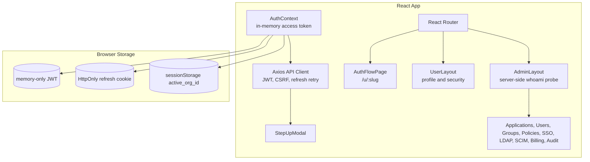
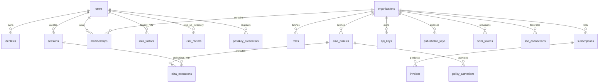

# IDaaS Platform - Current Technical Architecture

This document describes the current application structure as implemented in the repository. It was refreshed against the backend router, Rust crate graph, frontend routes, Docker Compose stack, and Terraform/Kubernetes infrastructure on 2026-05-10.

For visual UML views, see [SYSTEM_DESIGN_UML.md](SYSTEM_DESIGN_UML.md). For the full route list, see [API_ENDPOINTS.md](API_ENDPOINTS.md).

## System Overview

IDaaS is an Identity-as-a-Service platform with hosted authentication, enterprise protocol support, B2B organization management, policy-driven authorization, and billing. The runtime model is not a pure RBAC system: session JWTs are identity-only, while privileged decisions are evaluated at request time by EIAA policy capsules.


```mermaid
flowchart TB
    subgraph Clients[Client Layer]
        HostedUI[React Hosted UI]
        AdminConsole[Admin Console]
        SDKs[SDKs and API Consumers]
        EnterpriseApps[Enterprise Apps]
    end

    subgraph ApiLayer[API Layer]
        ApiServer[api_server Axum HTTP :3000]
        Middleware[Security Middleware\nCORS, CSRF, rate limits, org context]
        EiaaLayer[EIAA Authz Layer]
    end

    subgraph Protocols[Protocol Surfaces]
        AuthFlow[Hosted Auth Flow]
        OAuthAs[OAuth 2.0 and OIDC AS]
        SsoSp[External SSO SP\nOAuth/OIDC and SAML]
        SamlIdp[SAML IdP]
        Scim[SCIM 2.0]
        ApiKeys[API Keys and Publishable Keys]
        Webhooks[Stripe Webhooks]
    end

    subgraph Domain[Domain Services in AppState]
        Identity[identity_engine\nusers, credentials, MFA, passkeys]
        Org[org_manager\norganizations, memberships, invitations]
        Billing[billing_engine\nsubscriptions, invoices, Stripe]
        Email[email_service\ntransactional email]
        Risk[risk_engine\nrisk scoring and lockout signals]
        OAuthService[OAuth AS service]
        ScimService[SCIM service]
    end

    subgraph EIAA[EIAA Capsule Runtime]
        PolicyBuilder[Policy Builder]
        Compiler[capsule_compiler\nAST verification and WASM lowering]
        RuntimeService[runtime_service gRPC :50061]
        Runtime[capsule_runtime\nWasmtime sandbox]
        Attestation[attestation\nBLAKE3 decision hash and Ed25519 signatures]
    end

    subgraph Data[Data Layer]
        Postgres[(PostgreSQL\nidentity, tenants, policies, audit, billing)]
        Redis[(Redis\nsessions, rate limits, nonces, flow state, caches)]
        Overflow[(Audit Overflow Queue\nlocal durable fallback)]
    end

    subgraph External[External Systems]
        Stripe[Stripe]
        Smtp[SendGrid or SMTP]
        SocialIdp[Google, GitHub, Microsoft]
        EnterpriseIdp[Okta, Entra ID, ADFS, SAML/OIDC IdPs]
        Hibp[Have I Been Pwned]
        GeoIp[IPLocate]
    end

    Clients --> ApiServer
    ApiServer --> Middleware --> EiaaLayer
    ApiServer --> Protocols
    ApiServer --> Domain
    EiaaLayer --> RuntimeService
    PolicyBuilder --> Compiler --> RuntimeService --> Runtime --> Attestation
    Domain --> Postgres
    Domain --> Redis
    EiaaLayer --> Postgres
    EiaaLayer --> Redis
    EiaaLayer --> Overflow
    Billing --> Stripe
    Email --> Smtp
    SsoSp --> SocialIdp
    SsoSp --> EnterpriseIdp
    SamlIdp --> EnterpriseApps
    Risk --> Hibp
    Risk --> GeoIp
```

## Current Service Boundaries

The repository is a Rust workspace, but runtime deployment has two primary backend processes:

| Runtime Process | Role | Port |
|---|---|---|
| `api_server` | Main HTTP API, route handlers, middleware, AppState service composition, protocol endpoints | `3000` |
| `runtime_service` | Internal gRPC service for EIAA capsule execution | `50061` |
| `frontend` | React/Vite application, served by Vite in development or nginx in container builds | `5173` dev / `8080` container |

Most domain services run inside `api_server` as Rust crate modules and AppState fields. The EIAA runtime is split into a dedicated gRPC process so authorization capsule execution is isolated from HTTP request handling.

## Technology Stack

| Layer | Technology | Current Use |
|---|---|---|
| Backend | Rust 2021 workspace, Axum 0.7, Tokio | HTTP API and service composition |
| Database | PostgreSQL 16 baseline, SQLx 0.7 | Persistent tenant, identity, billing, policy, audit, and protocol data |
| Cache / Ephemeral State | Redis 7 | Sessions, auth flow state, OAuth state/PKCE, nonces, rate limits, capsule cache |
| Frontend | React 18, TypeScript 5, Vite 5, React Router 6 | Hosted login, user portal, admin console |
| UI Styling | Tailwind CSS, local component system | Admin and hosted UI screens |
| HTTP Client | Axios | Authenticated API client, CSRF handling, refresh retry, attestation verification |
| Passkeys | WebAuthn / `@simplewebauthn/browser` | Public passkey login and protected passkey management |
| EIAA Runtime | Tonic gRPC, Wasmtime, Ed25519, BLAKE3 | Signed policy capsule execution and attested decisions |
| Email | Lettre / SendGrid SMTP | Verification and transactional email |
| Billing | Stripe API and webhook verification | Subscriptions, invoices, checkout, billing portal |
| Observability | tracing, Prometheus metrics endpoint | Structured logs and `/metrics` scraping |
| Local Infra | Docker Compose / Podman | PostgreSQL 16, Redis 7, MailHog, MinIO, pgAdmin, Redis Commander |
| Cloud Infra | Terraform, EKS, RDS, ElastiCache, Kustomize | Staging/production AWS deployment |

Note: `xstate` and `@xstate/react` are dependencies, but the current frontend auth runtime is implemented through `AuthContext`, route components, and hooks rather than an imported XState machine.

## Backend Workspace Architecture


```mermaid
flowchart LR
    subgraph Binaries[Runtime Binaries]
        Api[api_server]
        RuntimeSvc[runtime_service]
        Migrator[migrator]
    end

    subgraph Core[Core Libraries]
        Shared[shared_types]
        AuthCore[auth_core]
        Keystore[keystore]
        Grpc[grpc_api]
        Migrations[db_migrations]
    end

    subgraph Domain[Domain Crates]
        Identity[identity_engine]
        Org[org_manager]
        Billing[billing_engine]
        Email[email_service]
        Risk[risk_engine]
    end

    subgraph Capsule[EIAA Crates]
        Compiler[capsule_compiler]
        CapsuleRuntime[capsule_runtime]
        Attestation[attestation]
    end

    Api --> Core
    Api --> Domain
    Api --> RuntimeSvc
    Api --> Migrations
    RuntimeSvc --> Grpc
    RuntimeSvc --> Compiler
    RuntimeSvc --> CapsuleRuntime
    Compiler --> Attestation
    CapsuleRuntime --> Attestation
    Attestation --> Keystore
    Domain --> Shared
    Domain --> AuthCore
```

| Crate | Current Responsibility |
|---|---|
| `api_server` | Axum router, middleware, AppState, route handlers, protocol surfaces, audit writer, policy builder services |
| `auth_core` | Identity-only JWT claims, session/token types, OAuth token types, action tokens |
| `identity_engine` | Users, identities, credentials, password verification, MFA, passkeys, SSO helpers, SAML helpers |
| `org_manager` | Organizations, memberships, invitations, applications/OAuth clients |
| `billing_engine` | Stripe checkout, portal, subscription/invoice sync, webhook handling |
| `email_service` | Transactional email abstraction and SMTP/SendGrid delivery |
| `risk_engine` | Contextual risk scoring, AAL requirements, geo-velocity and lockout signals |
| `keystore` | ES256 and Ed25519 key generation/signing support |
| `attestation` | Canonical decision hash/signature verification support |
| `capsule_compiler` | Policy AST verification and deterministic WASM lowering |
| `capsule_runtime` | Wasmtime sandbox execution primitives |
| `runtime_service` | gRPC capsule execution service used by `api_server` |
| `grpc_api` | Tonic-generated gRPC bindings |
| `db_migrations` | SQLx migrations, automatically run during AppState startup |
| `migrator` | Dedicated migration runner binary |
| `shared_types` | Common errors, IDs, validation helpers, shared DTOs |

## API Server Composition

`api_server` builds a single `AppState` with Clone-cheap service fields. Important services include:

- Primary PostgreSQL pool and optional read-replica pool manager.
- Redis connection manager with standalone, Sentinel, and future cluster modes.
- `JwtService`, `NonceStore`, `CapsuleCacheService`, `AuditWriter`, `RuntimeKeyCache`, `AttestationVerifier`, and `AttestationDecisionCache`.
- Domain services for users, organizations, billing, invitations, passkeys, MFA, OAuth AS, SSO connections, SCIM, client scopes, publishable keys, API keys, password policies, required actions, LDAP, and unified credentials.
- Shared `runtime_client` with a process-wide gRPC circuit breaker for EIAA runtime calls.
- Secret-store abstraction for database, AWS KMS, or Vault-backed secrets.
- Local sled-backed audit overflow queue for durable fallback when primary audit persistence is unavailable.

The router is layered in this order conceptually:

1. Public and mixed protocol routes: hosted auth flow, signup, SSO callbacks, OAuth, OIDC discovery, SAML IdP metadata, SCIM discovery, passkey login, invitations, SDK manifest, CSRF token, health, metrics.
2. Protected route groups with route-specific EIAA actions.
3. Session lifecycle routes for logout, refresh, and step-up.
4. API key auth middleware, org context middleware, global rate limiting, security headers, CSRF protection, CORS, and request tracking.

## Protocol Surfaces

| Surface | Mounts | Purpose |
|---|---|---|
| Hosted auth flow | `/api/auth/flow/*`, `/api/hosted/*`, `/u/:slug` frontend | Tenant-branded login, signup, reset-password, MFA/passkey steps |
| Session auth | `/api/v1/sign-in`, `/api/v1/sign-up`, `/api/v1/logout`, `/api/v1/token/refresh` | Helper auth routes and refresh-cookie lifecycle |
| OAuth 2.0 AS | `/oauth/*`, `/api/oauth/*` | Authorization code, PKCE, token, revoke, introspect, UserInfo, consent, PAR, device flow, dynamic registration |
| OIDC | `/.well-known/openid-configuration`, `/.well-known/jwks.json`, `/oauth/userinfo` | Discovery, JWKS, ID-token/userinfo semantics |
| External SSO SP | `/api/auth/sso/*` | Social/enterprise OAuth/OIDC login and SAML SP login/logout |
| SAML IdP | `/api/saml/idp/:tenant_id/*` | IDaaS acting as a SAML identity provider for service providers |
| SCIM 2.0 | `/scim/v2/*`, `/api/admin/v1/scim/*` | Inbound user/group provisioning and admin token/config management |
| API keys | `/api/v1/api-keys` | Scoped developer keys for server-side API access |
| Publishable keys | `/api/v1/publishable-keys`, `/api/v1/sdk/manifest` | Browser/SDK bootstrap and org manifest access |
| Billing | `/api/billing/v1/*` | Subscription reads/writes and Stripe webhook processing |
| Policy builder | `/api/v1/policy-builder/*` | No-code EIAA policy config, simulation, compilation, activation, versioning |
| Audit decisions | `/api/decisions/*`, `/api/v1/audit/reexecution/*`, `/api/admin/v1/audit/*` | Decision lookup, attestation verification, forensic re-execution |

## EIAA Authorization Model

EIAA means Entitlement-Independent Authentication Architecture in this codebase. Its core invariant is: IDaaS session JWTs are identity-only. They carry subject/session/tenant context, but not roles, permissions, scopes, or entitlements.


```mermaid
sequenceDiagram
    autonumber
    participant Client
    participant API as api_server
    participant Auth as JWT and Session Checks
    participant EIAA as EiaaAuthzLayer
    participant Risk as risk_engine
    participant Runtime as runtime_service
    participant Wasm as Wasmtime Capsule
    participant Audit as Audit Writer
    participant Handler as Route Handler

    Client->>API: Protected request with identity JWT
    API->>Auth: Verify JWT and active session
    Auth-->>API: Claims with subject, tenant, sid, session type
    API->>EIAA: Evaluate action and request context
    EIAA->>Risk: Compute risk and AAL signals
    EIAA->>Runtime: Execute signed capsule
    Runtime->>Wasm: Run policy in sandbox
    Wasm-->>Runtime: allow, deny, or need_input
    Runtime-->>EIAA: Decision, attestation, nonce
    EIAA->>Audit: Persist decision and attestation
    alt allow
        EIAA->>Handler: Continue
    else deny
        EIAA-->>Client: 403
    else need_input
        EIAA-->>Client: 403 AUTH_STEP_UP_REQUIRED
    end
```

Key properties:

- Policies are authored as JSON ASTs, verified by compiler rules, lowered to WASM, and signed with Ed25519.
- WASM executes in Wasmtime without giving application code direct authorization authority.
- Decisions are attested using canonical BLAKE3 decision hashes and Ed25519 signatures.
- Nonces are replay-protected through Redis plus PostgreSQL permanence.
- Redis caches capsules and time-window validity, while PostgreSQL stores policies, activations, executions, audit events, and forensic history.
- Frontend code verifies returned attestations when present and refreshes runtime keys from `/api/eiaa/v1/runtime/keys`.

## Frontend Architecture

The frontend is a React 18/Vite application with separate hosted-login, user-account, and admin-console experiences.


```mermaid
flowchart TB
    subgraph Browser[React App]
        Router[React Router]
        AuthProvider[AuthContext\nin-memory access token]
        ApiClient[Axios API Client\nJWT, CSRF, refresh retry]
        Hosted[AuthFlowPage\n/u/:slug]
        UserPortal[UserLayout\nprofile and security]
        Admin[AdminLayout\nserver-side whoami probe]
        StepUp[StepUpModal]
        AdminFeatures[Applications, Users, Groups, Policies, SSO, LDAP, SCIM, Billing, Audit]
    end

    subgraph Storage[Browser Storage]
        Memory[(memory-only JWT)]
        Cookie[(HttpOnly refresh cookie)]
        SessionOrg[(sessionStorage active_org_id)]
    end

    Router --> Hosted
    Router --> UserPortal
    Router --> Admin
    AuthProvider --> ApiClient
    AuthProvider --> Memory
    AuthProvider --> Cookie
    AuthProvider --> SessionOrg
    ApiClient --> StepUp
    Admin --> AdminFeatures
```

Important frontend behaviors:

- Access JWTs are kept in memory, not localStorage/sessionStorage.
- Refresh tokens are HttpOnly cookies set by the backend.
- `AuthContext` silently refreshes access tokens on load and schedules refresh before expiry.
- The Axios client injects `Authorization`, `X-Organization-Id`, and `x-csrf-token` headers.
- A `403 AUTH_STEP_UP_REQUIRED` response dispatches a global event that opens `StepUpModal`.
- `AdminLayout` probes `/api/admin/v1/whoami` server-side instead of trusting client-only admin state.
- The admin console includes applications, API keys, login methods, SSO, LDAP, SCIM, policy builder, users, groups, roles, attack protection, security policies, branding, domains, billing, vault settings, and audit logs.

## Data Architecture

The database is tenant-scoped and migration-driven. Migrations live in `backend/crates/db_migrations/migrations` and are applied at AppState startup.


```mermaid
erDiagram
    users ||--o{ identities : owns
    users ||--o{ sessions : creates
    users ||--o{ memberships : joins
    users ||--o{ mfa_factors : legacy_mfa
    users ||--o{ user_factors : step_up_inventory
    users ||--o{ passkey_credentials : registers
    organizations ||--o{ memberships : contains
    organizations ||--o{ roles : defines
    organizations ||--o{ subscriptions : bills
    organizations ||--o{ api_keys : owns
    organizations ||--o{ publishable_keys : exposes
    organizations ||--o{ scim_tokens : provisions
    organizations ||--o{ sso_connections : federates
    organizations ||--o{ eiaa_policies : defines
    eiaa_policies ||--o{ policy_activations : activates
    eiaa_policies ||--o{ eiaa_executions : executes
    sessions ||--o{ eiaa_executions : authorizes_with
    subscriptions ||--o{ invoices : produces
```

Current schema highlights:

- `users`, `identities`, `sessions`, `organizations`, `memberships`, `roles`, and invitations back identity and B2B organization management.
- `mfa_factors` and `user_factors` both exist. Legacy MFA routes use `mfa_factors`; step-up and factor inventory use a bridge over both tables.
- `passkey_credentials` stores WebAuthn credentials.
- `eiaa_policies`, policy activation tables, capsule storage columns, `eiaa_executions`, audit events, nonces, and decision references back EIAA runtime authorization and forensic replay.
- `api_keys`, `publishable_keys`, OAuth client/token tables, `scim_tokens`, SSO connections, LDAP connections, and signing keys back protocol/integration surfaces.
- Billing data includes organizations, subscriptions, subscription items, invoices, Stripe customer/subscription IDs, and webhook-synchronized state.
- RLS context is set per database connection/request using `app.current_org_id`; unset context is intentionally rejected by policies.

## Security Architecture

| Area | Current Design |
|---|---|
| Session JWTs | ES256 identity-only claims; no roles, scopes, or permissions in IDaaS session JWTs |
| Refresh | HttpOnly refresh cookie; `/api/v1/token/refresh` validates session and re-runs risk guard |
| Authorization | Per-route EIAA action evaluation with risk, session, tenant, and request context |
| Step-up | EIAA can return `need_input`; frontend opens `StepUpModal`; current session AAL is elevated after factor proof |
| MFA | TOTP, backup codes, and user factor inventory; TOTP secrets require `FACTOR_ENCRYPTION_KEY` in production/staging |
| Passkeys | WebAuthn public auth routes and protected management routes |
| CSRF | `/api/csrf-token`; mutating browser requests include `x-csrf-token` |
| CORS | `ALLOWED_ORIGINS` is mandatory in production/staging |
| OAuth/OIDC | OAuth scopes remain protocol consent; protected resource authorization maps scopes to EIAA actions |
| SAML | Supports both SAML SP login and SAML IdP SSO response generation |
| SCIM | SCIM bearer token binds provisioning calls to tenant context |
| Audit | Sensitive operations and EIAA decisions are stored; overflow queue provides local durable fallback |
| Startup hard-fails | Production-like environments require critical secrets such as `FACTOR_ENCRYPTION_KEY`, `COMPILER_SK_B64`, `ALLOWED_ORIGINS`, and production passkey RP configuration |

## Local Development

### Prerequisites

- Rust toolchain compatible with the 2021 workspace.
- Node.js 20+.
- PostgreSQL and Redis, either local or through Docker/Podman Compose.
- SQLx CLI if running migrations manually.

### Docker Compose Stack

```bash
cd infrastructure/docker-compose
docker compose -f docker-compose.dev.yml up -d
```

The development Compose stack includes:

| Service | Port | Purpose |
|---|---:|---|
| PostgreSQL 16 | `5432` | Primary database |
| Redis 7 | `6379` | Cache/session/rate-limit/nonce state |
| MailHog | `1025`, `8025` | Local email capture |
| MinIO | `9000`, `9001` | Local S3-compatible storage |
| pgAdmin | `5050` | Database UI |
| Redis Commander | `8081` | Redis UI |
| backend | `3000` | API server container |
| runtime | `50061` | EIAA runtime service container |
| frontend | `8080` | nginx-served frontend container |

### Manual Startup

```bash
# backend API
cd backend
cargo run --bin api_server

# EIAA runtime service
cd backend
cargo run --bin runtime_service

# frontend dev server
cd frontend
npm install
npm run dev
```

## Configuration

| Variable | Required | Purpose |
|---|---|---|
| `DATABASE_URL` | Yes | Primary PostgreSQL connection string |
| `REDIS_URL` or `REDIS_URLS` | Yes | Redis standalone/Sentinel/cluster endpoints |
| `REDIS_MODE` | No | `standalone`, `sentinel`, or `cluster`; defaults to standalone |
| `JWT_PRIVATE_KEY` / `JWT_PUBLIC_KEY` | Yes | ES256 session JWT signing and verification |
| `JWT_ISSUER` / `JWT_AUDIENCE` | No | JWT issuer/audience validation values |
| `RUNTIME_GRPC_ADDR` | No | Primary runtime service URL, default `http://127.0.0.1:50061` |
| `RUNTIME_GRPC_ENDPOINTS` | No | Comma-separated runtime endpoints for client-side balancing |
| `COMPILER_SK_B64` | Production-like | Persistent Ed25519 key for EIAA capsule signing |
| `FACTOR_ENCRYPTION_KEY` | Production-like | Encrypts MFA/TOTP factor secrets |
| `ALLOWED_ORIGINS` | Production-like | CORS allowlist |
| `FRONTEND_URL` | No | Redirect/callback frontend origin |
| `PASSKEY_RP_ID` / `PASSKEY_ORIGIN` | Production-like | WebAuthn relying party configuration |
| `STRIPE_SECRET_KEY` / `STRIPE_WEBHOOK_SECRET` | Billing | Stripe API and webhook verification |
| `SENDGRID_API_KEY` / `SENDGRID_FROM_EMAIL` | Email | Transactional email delivery |
| `OAUTH_DCR_INITIAL_ACCESS_TOKEN` | Optional | Enables OAuth dynamic client registration |
| `USE_PGBOUNCER`, `PGBOUNCER_URL` | Optional | PgBouncer transaction-pooling support |
| `ENABLE_READ_REPLICAS`, `READ_REPLICA_URLS` | Optional | Read-replica pool routing |
| `EIAA_RISK_THRESHOLD` | Optional | Risk score cutoff for EIAA denial/refresh guard |
| `HIBP_ENABLED`, `IPLOCATE_ENABLED`, `IPLOCATE_API_KEY` | Optional | Breached-password and geo-risk integrations |

## Deployment Architecture

### Containers

| Image | Dockerfile | Runtime |
|---|---|---|
| backend | `backend/Dockerfile` | `api_server` HTTP API |
| runtime | `backend/Dockerfile.runtime` | `runtime_service` gRPC service |
| frontend | `frontend/Dockerfile` | Vite build served by nginx |

### Kubernetes

Kubernetes manifests use Kustomize base/overlays under `infrastructure/kubernetes`:

```text
infrastructure/kubernetes/
  base/
    backend-deployment.yaml
    frontend-deployment.yaml
    runtime-deployment.yaml
    db-migration-job.yaml
    configmap.yaml
    secrets.yaml
    ingress.yaml
    hpa.yaml
    pdb.yaml
    network-policy.yaml
    service-monitor.yaml
  overlays/
    staging/
    production/
```

### AWS Terraform

Terraform provisions AWS infrastructure under `infrastructure/terraform`:

| Module | Current Target |
|---|---|
| `vpc` | Multi-AZ VPC, subnets, NAT, endpoints, flow logs |
| `eks` | EKS 1.29 with managed node groups and IRSA |
| `rds` | PostgreSQL 16.3 baseline, Multi-AZ, KMS encryption, performance insights |
| `redis` | ElastiCache Redis 7.1 replication group with encryption and failover |
| `secrets` | AWS Secrets Manager integration |

Production tfvars currently target three availability zones, `db.r6g.large` RDS, and a two-node Redis replication group.

## Testing and Validation

```bash
# Backend workspace tests
cd backend
cargo test --all-features

# Focused backend crate tests
cargo test -p identity_engine

# Frontend unit tests
cd frontend
npm run test:unit

# Frontend E2E tests
cd frontend
npm test
```

Non-production builds expose `/api/test/*` seed and cleanup endpoints for E2E setup. These are omitted when the backend is built with the `production` feature.

## Current Architecture Notes

- The application is no longer accurately described as only a B2B RBAC platform. RBAC-like roles still exist for organization management and UI workflows, but protected operations rely on EIAA runtime decisions.
- The protocol surface now includes OAuth 2.0/OIDC authorization server behavior, external OAuth/OIDC SSO, SAML SP, SAML IdP, SCIM 2.0, API keys, publishable keys, Stripe webhooks, and hosted auth flows.
- The frontend stores access tokens only in memory and depends on an HttpOnly refresh cookie for reload/session continuity.
- The API documentation in [API_ENDPOINTS.md](API_ENDPOINTS.md) is the source for route-level details; this document intentionally focuses on architecture and boundaries.

## Related Documents

- [API_ENDPOINTS.md](API_ENDPOINTS.md) - current route reference.
- [SYSTEM_DESIGN_UML.md](SYSTEM_DESIGN_UML.md) - UML-style diagrams for the current system.
- [INTEGRATION_GUIDE.md](INTEGRATION_GUIDE.md) - integration guidance.
- [../TECHNICAL_DOCUMENTATION.md](../TECHNICAL_DOCUMENTATION.md) - broader project notes.
