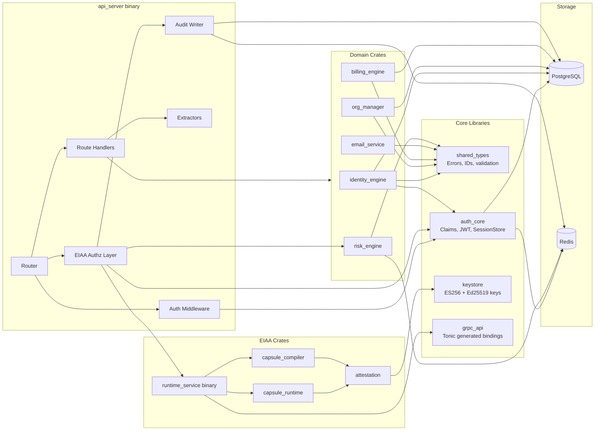
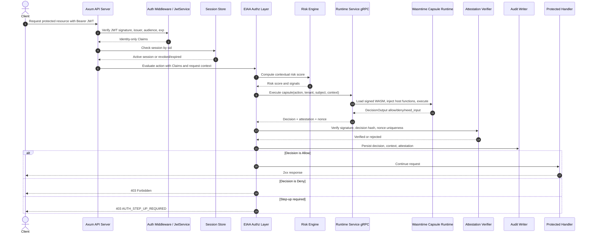
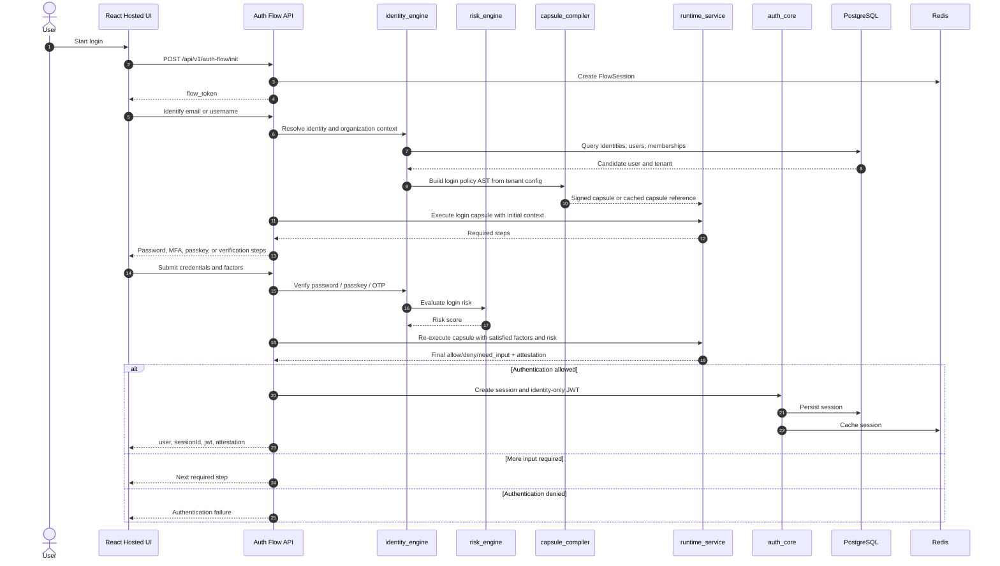
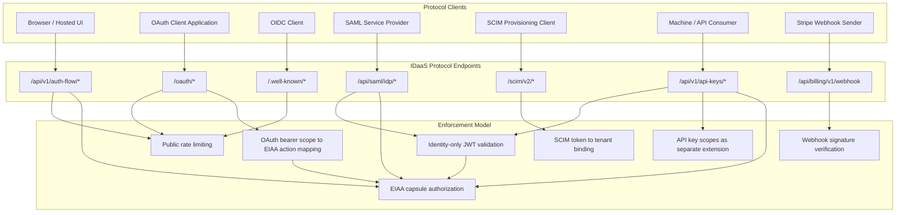
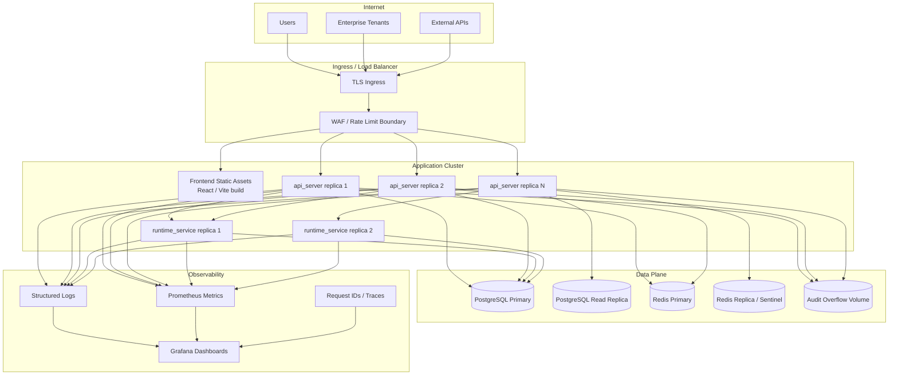
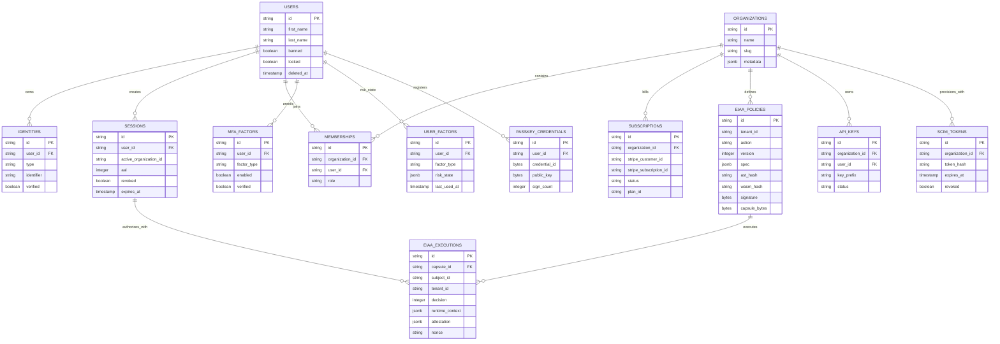
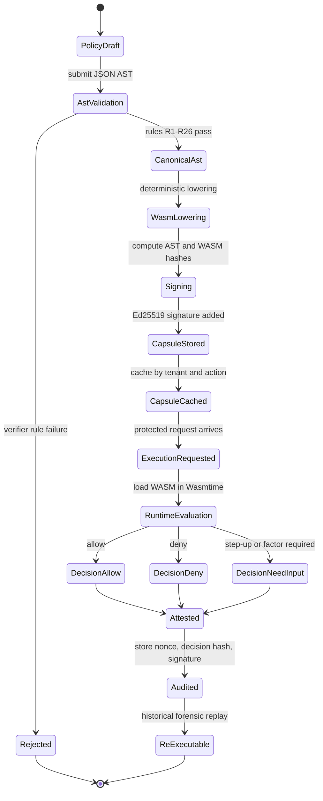
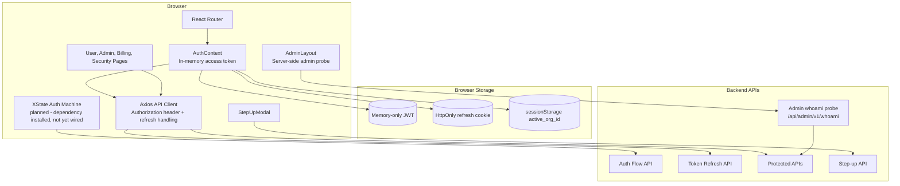

# IDaaS System Design UML Diagrams

This document captures the IDaaS platform as a set of UML-style Mermaid diagrams. It is intended to complement [ARCHITECTURE.md](ARCHITECTURE.md) and [TECHNICAL_DOCUMENTATION.md](../TECHNICAL_DOCUMENTATION.md) with a more visual system-design view.

## Design Principles

- JWTs are identity-only. They carry identity context such as subject, session, tenant, and session type, but never roles, permissions, scopes, or entitlements.
- Authorization is evaluated at request time by EIAA policy capsules.
- Web/API clients do not make privileged authorization decisions locally.
- Sessions, policy executions, nonce replay protection, and audit records are server-side concerns.
- Protocol surfaces such as OAuth 2.0, OIDC, SAML, SCIM, API keys, and webhooks remain protocol-compliant while preserving the EIAA invariant.

## 1. System Context Diagram

```mermaid
flowchart TB
    subgraph ClientLayer[Client Layer]
        ReactUI[React Hosted UI]
        AdminConsole[Admin Console]
        JsSdk[JavaScript / TypeScript SDK]
        PyGoSdk[Python / Go SDKs]
        MobileApps[Mobile Applications]
        EnterpriseApps[Enterprise Applications]
    end

    subgraph EdgeLayer[Edge / API Layer]
        ApiServer[Axum API Server\nHTTP :3000]
        SecurityMiddleware[Security Middleware\nCORS, CSRF, Rate Limit, Headers]
        EiaaMiddleware[EIAA Authorization Middleware\nJWT Verify + Capsule Decision]
    end

    subgraph ProtocolLayer[Identity Protocol Surfaces]
        AuthFlow[Hosted Auth Flow\nPassword, MFA, Passkeys]
        OAuthAs[OAuth 2.0 / OIDC AS]
        SamlIdp[SAML IdP]
        Scim[SCIM 2.0]
        ApiKeys[API Keys]
        Webhooks[Webhooks]
    end

    subgraph DomainLayer[Domain Services / Rust Crates]
        AuthCore[auth_core\nJWT + Sessions]
        IdentityEngine[identity_engine\nUsers + Credentials + MFA]
        OrgManager[org_manager\nOrganizations + Memberships]
        BillingEngine[billing_engine\nSubscriptions + Stripe Sync]
        RiskEngine[risk_engine\nRisk Scoring]
        EmailService[email_service\nTransactional Email]
    end

    subgraph EiaaLayer[EIAA Capsule System]
        PolicyBuilder[Policy Builder\nTemplates + AST]
        CapsuleCompiler[capsule_compiler\nAST Verify + WASM Lowering]
        RuntimeService[runtime_service\ngRPC :50061]
        CapsuleRuntime[capsule_runtime\nWasmtime Sandbox]
        Attestation[attestation\nDecision Hash + Ed25519]
    end

    subgraph DataLayer[Data Layer]
        Postgres[(PostgreSQL\nIdentity, Orgs, Sessions, Policies, Audit)]
        Redis[(Redis\nSessions, Nonces, Rate Limits, Capsule Cache)]
        Overflow[(Audit Overflow Queue\nLocal durable fallback)]
    end

    subgraph ExternalSystems[External Systems]
        OAuthProviders[OAuth Providers\nGoogle, GitHub, Microsoft]
        Stripe[Stripe]
        MailProvider[SendGrid / SMTP]
        SmsProvider[Twilio / SMS]
        EnterpriseIdp[Enterprise IdP\nSAML / OIDC]
    end

    ReactUI --> ApiServer
    AdminConsole --> ApiServer
    JsSdk --> ApiServer
    PyGoSdk --> ApiServer
    MobileApps --> ApiServer
    EnterpriseApps --> OAuthAs
    EnterpriseApps --> SamlIdp
    EnterpriseApps --> Scim

    ApiServer --> SecurityMiddleware
    SecurityMiddleware --> EiaaMiddleware
    ApiServer --> ProtocolLayer
    ApiServer --> DomainLayer
    EiaaMiddleware --> RuntimeService

    AuthFlow --> IdentityEngine
    OAuthAs --> AuthCore
    OAuthAs --> EiaaMiddleware
    SamlIdp --> IdentityEngine
    Scim --> IdentityEngine
    ApiKeys --> AuthCore
    Webhooks --> BillingEngine

    IdentityEngine --> AuthCore
    IdentityEngine --> RiskEngine
    IdentityEngine --> OrgManager
    BillingEngine --> Stripe
    EmailService --> MailProvider
    IdentityEngine --> SmsProvider
    IdentityEngine --> OAuthProviders
    OAuthAs --> EnterpriseIdp
    SamlIdp --> EnterpriseIdp

    PolicyBuilder --> CapsuleCompiler
    CapsuleCompiler --> RuntimeService
    RuntimeService --> CapsuleRuntime
    CapsuleRuntime --> Attestation
    Attestation --> Postgres

    AuthCore --> Postgres
    AuthCore --> Redis
    IdentityEngine --> Postgres
    OrgManager --> Postgres
    BillingEngine --> Postgres
    RiskEngine --> Redis
    EiaaMiddleware --> Redis
    EiaaMiddleware --> Postgres
    EiaaMiddleware --> Overflow
```

## 2. Backend Component Diagram

## 3. EIAA Protected Request Sequence

## 4. Authentication Flow Sequence

## 5. Protocol Surface Diagram

## 6. Deployment Topology Diagram

> Reference topology. Local development runs a single PostgreSQL instance and a single Redis instance, without WAF, replicas, or Sentinel. The diagram below describes the production-grade target deployment.

## 7. Core Data Ownership Diagram

> Note: compiled capsule artifacts (AST hash, WASM hash, Ed25519 signature, capsule bytes) live as columns on `eiaa_policies` together with the `policy_activations` table; there is no separate `eiaa_compiled_capsules` table.

## 8. EIAA Capsule Lifecycle State Diagram

## 9. Frontend Runtime Diagram

## Reading Guide

- Use the system context diagram for executive and architecture discussions.
- Use the backend component diagram when changing Rust crates or middleware boundaries.
- Use the protected request sequence when reviewing EIAA correctness.
- Use the authentication sequence when debugging login, MFA, passkeys, or step-up flows.
- Use the protocol surface diagram when auditing OAuth, OIDC, SAML, SCIM, API keys, or webhooks.
- Use the data ownership diagram when adding migrations or changing persistence contracts.
