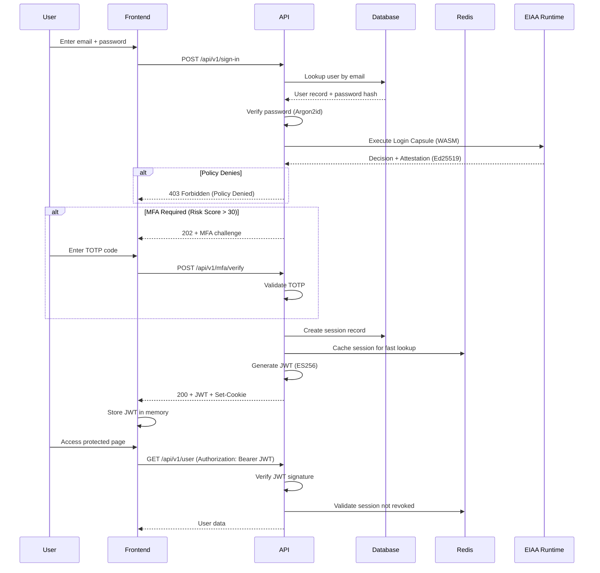
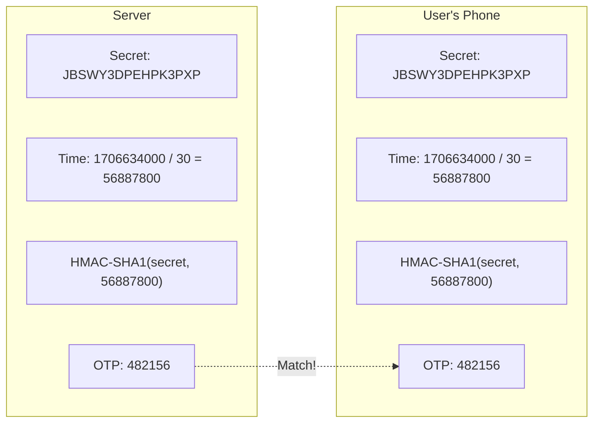
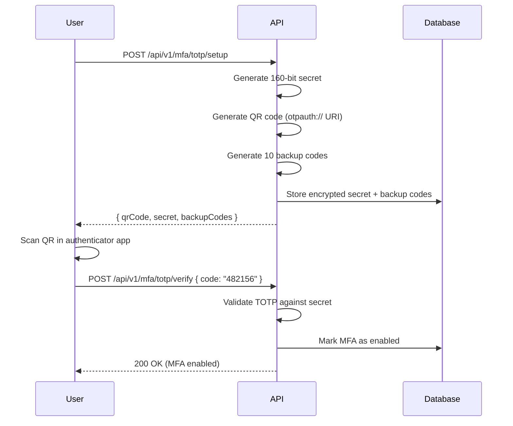
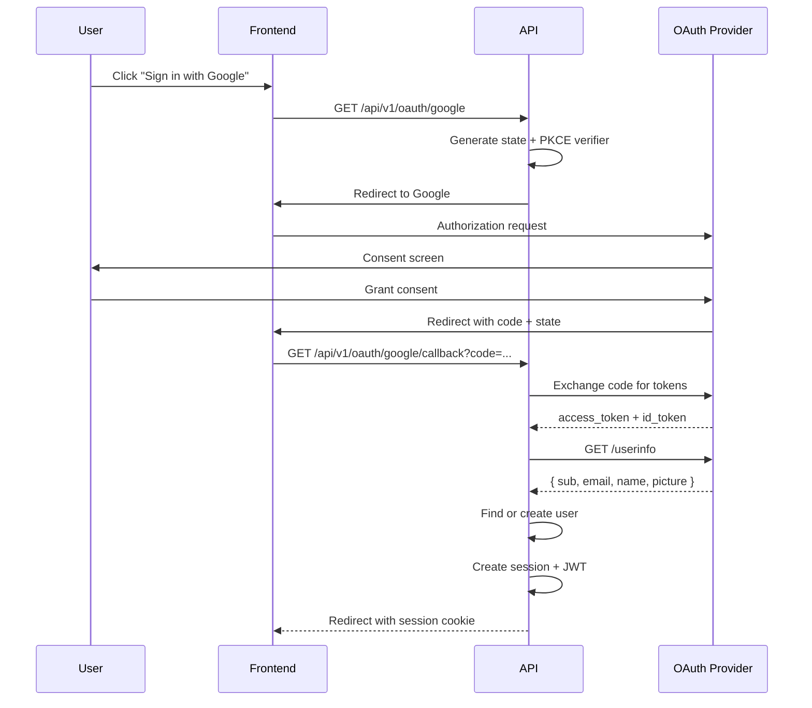
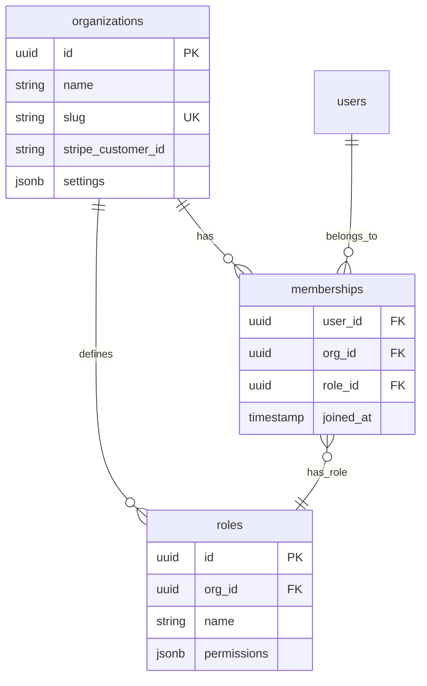
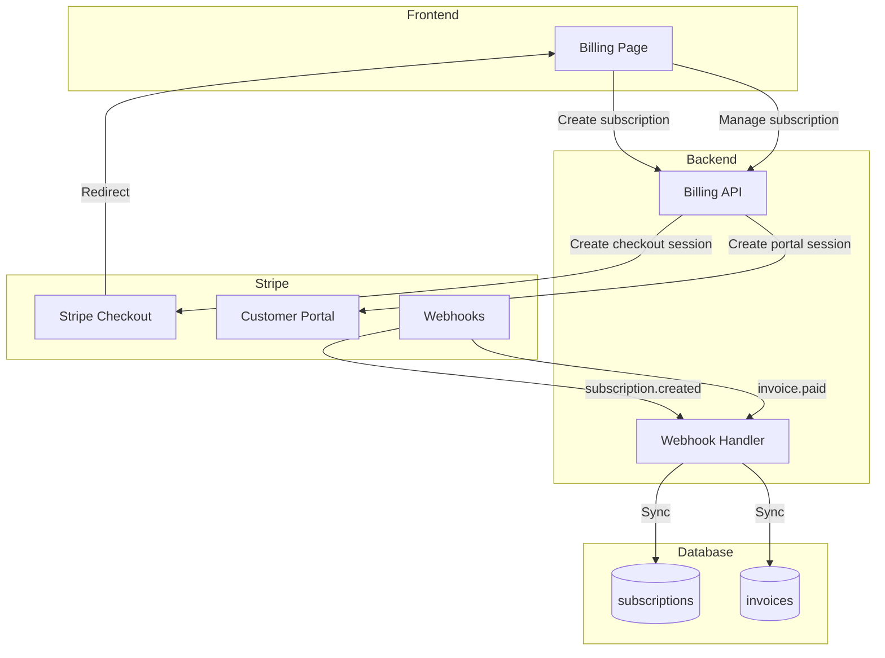

# IDaaS Platform - Technical Overview

This document provides an in-depth explanation of how the IDaaS platform works, covering the technologies, design patterns, and security mechanisms used throughout the system.

---

## Table of Contents

1. [Executive Summary](#executive-summary)
2. [How Authentication Works](#how-authentication-works)
3. [How JWT Tokens Work](#how-jwt-tokens-work)
4. [How Password Security Works](#how-password-security-works)
5. [How Multi-Factor Authentication Works](#how-multi-factor-authentication-works)
6. [How OAuth Integration Works](#how-oauth-integration-works)
7. [How Organizations & Multi-Tenancy Work](#how-organizations--multi-tenancy-work)
8. [How Billing Integration Works](#how-billing-integration-works)
9. [How Risk Detection Works](#how-risk-detection-works)
10. [Technology Deep Dives](#technology-deep-dives)

---

## Executive Summary

IDaaS is a **production-grade Identity-as-a-Service platform** built with:

| Component | Technology | Why We Chose It |
|-----------|------------|-----------------|
| **Backend** | Rust + Axum | Memory safety, zero-cost abstractions, ~10x faster than Node.js |
| **Database** | PostgreSQL 16 | ACID compliance, JSONB support, row-level security |
| **Cache** | Redis 7 | Sub-millisecond latency for sessions and rate limiting |
| **Policy Engine** | WASM (Wasmtime) | Logic portability, sandboxed execution, cryptographic attestation |
| **Frontend** | React 18 + TypeScript | Type safety, ecosystem maturity, component reusability |
| **Build Tool** | Vite | 10-100x faster HMR than Webpack |
| **Payments** | Stripe | Industry standard, PCI compliance, webhooks |
| **Email** | SendGrid | Deliverability tracking, templates, analytics |

---

## How Authentication Works

### The Authentication Flow



### Key Design Decisions

1. **Short-lived JWTs (60 seconds)**: JWTs expire quickly to minimize the window of compromise. Session cookies (HttpOnly) are used for automatic refresh.

2. **Session-backed tokens**: Every JWT contains a `sid` (session ID) that can be revoked instantly via Redis, unlike traditional JWTs that can't be invalidated.

3. **Device fingerprinting**: Sessions track IP address and User-Agent to detect suspicious access patterns.

---

## How EIAA Works (The Core)

**Entitlement-Independent Authentication Architecture (EIAA)** is the platform's defining feature. It decouples **authentication mechanics** from **authorization logic**.

### The Pipeline

1.  **Policy Definition**: Tenants write policies in JSON (e.g., "Allow if MFA is enabled OR risk score < 20").
2.  **Compilation**: The `capsule_compiler` compiles JSON polices into **WebAssembly (WASM)** binaries called "Capsules".
3.  **Execution**: The `capsule_runtime` (embedding Wasmtime) executes the capsule with a `RuntimeContext` (User, Risk, Request Data).
4.  **Attestation**: The runtime cryptographically signs the result (Allow/Deny) using an Ed25519 key.

### Why WASM?

-   **Sandboxing**: Policies cannot crash the authentication server or access unauthorized memory.
-   **Portability**: Capsules can run on the server, in a sidecar, or even on the edge.
-   **Determinism**: Given the same context, a capsule always outputs the same decision.

### The Attestation Artifact

Every decision produces a verifiable proof:

```json
{
  "outcome": "allow",
  "signature": "base64_ed25519_sig",
  "meta": {
    "policy_hash": "sha256_of_policy_json",
    "capsule_hash": "sha256_of_wasm_binary",
    "timestamp": 1706634000
  }
}
```

This allows **auditors** to cryptographically verify exactly *which* policy version authorized *which* user action.

---

## How JWT Tokens Work

### Technology: ES256 (ECDSA with P-256)

We use **asymmetric cryptography** for JWTs instead of HMAC (HS256):

| Aspect | HS256 (Symmetric) | ES256 (Asymmetric) |
|--------|-------------------|---------------------|
| **Key sharing** | Same secret everywhere | Private key stays on server |
| **Verification** | Requires secret | Anyone can verify with public key |
| **Attack surface** | Secret leak = full compromise | Private key leak only |
| **Key rotation** | Painful | Seamless via JWKS |

### JWT Structure

```json
{
  "header": {
    "alg": "ES256",
    "typ": "JWT"
  },
  "payload": {
    "sub": "usr_a1b2c3d4",       // User ID
    "iss": "https://auth.idaas.example",
    "aud": "https://api.idaas.example",
    "exp": 1706634060,          // 60 seconds from now
    "iat": 1706634000,
    "nbf": 1706634000,
    "sid": "sess_x9y8z7",       // Session ID (revocable!)
    "tenant_id": "org_m5n6o7",  // Organization context
    "session_type": "end_user"  // end_user | admin | flow | service
  }
}
```

### What's NOT in the JWT

Following **EIAA (Entitlement-Independent Authentication Architecture)** principles:

> ❌ `roles`
> ❌ `permissions`
> ❌ `scopes`
> ❌ `entitlements`

**Why?** Authorization is determined at runtime by querying the database, not by trusting JWT claims. This allows:
- Instant permission changes (no waiting for token refresh)
- Audit-compliant access control
- Context-aware authorization

### Implementation

```rust
// backend/crates/auth_core/src/jwt.rs

pub struct JwtService {
    encoding_key: EncodingKey,  // ES256 private key
    decoding_key: DecodingKey,  // ES256 public key
    issuer: String,
    audience: String,
    expiration_seconds: i64,    // Default: 60
}

impl JwtService {
    pub fn generate_token(&self, user_id: &str, session_id: &str, ...) -> Result<String> {
        let claims = Claims { sub, iss, aud, exp, iat, nbf, sid, tenant_id, session_type };
        let header = Header::new(Algorithm::ES256);
        encode(&header, &claims, &self.encoding_key)
    }
    
    pub fn verify_token(&self, token: &str) -> Result<Claims> {
        let validation = Validation::new(Algorithm::ES256);
        // Validates: signature, expiration, issuer, audience
        decode::<Claims>(token, &self.decoding_key, &validation)
    }
}
```

---

## How Password Security Works

### Technology: Argon2id

Argon2 is the **winner of the Password Hashing Competition (2015)** and is recommended by OWASP.

| Parameter | Value | Purpose |
|-----------|-------|---------|
| **Algorithm** | Argon2id | Hybrid of Argon2i (side-channel resistant) and Argon2d (GPU resistant) |
| **Memory** | 64 MB | Makes GPU/ASIC attacks expensive |
| **Iterations** | 3 | Time cost for computation |
| **Parallelism** | 4 | CPU thread utilization |
| **Salt** | 128-bit random | Prevents rainbow table attacks |

### Why Argon2id Over bcrypt/scrypt?

| Algorithm | GPU Resistance | Memory Hardness | Modern Standard |
|-----------|----------------|-----------------|-----------------|
| bcrypt | Low | No | ⚠️ Legacy |
| scrypt | Medium | Yes | ⚠️ Complex params |
| **Argon2id** | **High** | **Yes** | ✅ **OWASP recommended** |

### Implementation

```rust
// backend/crates/auth_core/src/password.rs

const MEMORY_SIZE: u32 = 65536;  // 64 MB
const ITERATIONS: u32 = 3;
const PARALLELISM: u32 = 4;

pub fn hash_password(password: &str) -> Result<String> {
    let salt = SaltString::generate(&mut OsRng);  // Cryptographically secure RNG
    let params = Params::new(MEMORY_SIZE, ITERATIONS, PARALLELISM, None)?;
    let argon2 = Argon2::new(Algorithm::Argon2id, Version::V0x13, params);
    
    let hash = argon2.hash_password(password.as_bytes(), &salt)?;
    Ok(hash.to_string())  // e.g., "$argon2id$v=19$m=65536,t=3,p=4$..."
}

pub fn verify_password(password: &str, hash: &str) -> Result<bool> {
    let parsed_hash = PasswordHash::new(hash)?;
    Ok(Argon2::default().verify_password(password.as_bytes(), &parsed_hash).is_ok())
}
```

### Resulting Hash Format

```
$argon2id$v=19$m=65536,t=3,p=4$c2FsdHN0cmluZw$hashedoutput
│        │     │              │               │
│        │     │              │               └─ Base64 hash output
│        │     │              └─ Base64 salt
│        │     └─ Parameters (m=memory, t=time, p=parallelism)
│        └─ Version
└─ Algorithm identifier
```

---

## How Multi-Factor Authentication Works

### Technology: TOTP (RFC 6238)

**Time-based One-Time Passwords** work by:

1. Server generates a **shared secret** (base32 encoded)
2. User scans QR code into authenticator app (Google Authenticator, Authy, etc.)
3. Both server and app compute: `HMAC-SHA1(secret, floor(time / 30))`
4. Result is truncated to 6 digits



### MFA Setup Flow



### Security Parameters

| Parameter | Value | Reason |
|-----------|-------|--------|
| **Digits** | 6 | Standard, 1M combinations |
| **Period** | 30 seconds | Balance of security and usability |
| **Window** | ±1 step | Allows for clock drift |
| **Backup codes** | 10 | Single-use recovery codes |
| **Algorithm** | HMAC-SHA1 | RFC 6238 standard |

---

## How OAuth Integration Works

### Supported Providers

| Provider | Scopes | Use Case |
|----------|--------|----------|
| **Google** | `openid email profile` | Consumer, G Suite |
| **GitHub** | `user:email read:user` | Developers |
| **Microsoft** | `openid email profile` | Enterprise, Azure AD |

### OAuth 2.0 + OIDC Flow



### Implementation Details

```rust
// backend/crates/identity_engine/src/services/oauth_service.rs

impl OAuthService {
    pub async fn exchange_code_for_token(&self, code: &str) -> Result<OAuthTokenResponse> {
        let response = self.http_client
            .post(&self.token_url)
            .form(&[
                ("client_id", &self.client_id),
                ("client_secret", &self.client_secret),
                ("code", code),
                ("grant_type", "authorization_code"),
                ("redirect_uri", &self.redirect_uri),
            ])
            .send()
            .await?;
        
        if !response.status().is_success() {
            let error_text = response.text().await.unwrap_or_else(|_| "Unknown error".to_string());
            return Err(AppError::External(format!("OAuth error: {}", error_text)));
        }
        
        Ok(response.json::<OAuthTokenResponse>().await?)
    }
}
```

---

## How Organizations & Multi-Tenancy Work

### Data Model



### Permission Model

Permissions follow the pattern: `resource:action`

```json
{
  "permissions": [
    "billing:read",
    "billing:write",
    "members:invite",
    "members:remove",
    "settings:*",      // Wildcard
    "*"                // Super admin
  ]
}
```

### Organization Context in Requests

```http
Authorization: Bearer eyJ...
X-Organization-ID: org_m5n6o7
```

Or embedded in JWT:
```json
{ "tenant_id": "org_m5n6o7" }
```

---

## How Billing Integration Works

### Technology: Stripe

We use Stripe's **Subscriptions API** with **Webhooks** for real-time sync.



### Webhook Events Handled

| Event | Action |
|-------|--------|
| `customer.subscription.created` | Insert subscription record |
| `customer.subscription.updated` | Update status/plan |
| `customer.subscription.deleted` | Mark as canceled |
| `invoice.paid` | Record payment, update status |
| `invoice.payment_failed` | Trigger dunning email |

### Idempotency

Webhooks can be delivered multiple times. We use the `event.id` for deduplication:

```sql
CREATE TABLE webhook_events (
    event_id TEXT PRIMARY KEY,
    event_type TEXT NOT NULL,
    processed_at TIMESTAMPTZ DEFAULT NOW()
);
```

---

## How Risk Detection Works

### Technology: Adaptive Authentication

The **Risk Engine** computes a threat score (0-100) based on signals collected by the `SignalCollector`.

| Signal Category | Examples | Implemented In |
|-----------------|----------|----------------|
| **Network** | IP Geolocation, VPN detection, ISP analysis | `signals/network.rs` |
| **Device** | Canvas fingerprinting, User-Agent analysis, Screen resolution | `signals/device.rs` |
| **Behavior** | Typing speed (keystroke dynamics), Mouse movement entropy | `signals/behavior.rs` |
| **History** | Previous login times, Location velocity (Impossible Travel) | `signals/history.rs` |

### Risk Score Actions

| Score | Action |
|-------|--------|
| 0-30 | Allow login |
| 31-60 | Require MFA step-up |
| 61-80 | Email notification + MFA |
| 81-100 | Block + alert admin |

### Baseline Computation

A background job runs hourly to compute normal behavior:

```rust
// backend/crates/risk_engine/src/jobs.rs

pub struct BaselineComputationJob { db: DatabasePool }

impl BaselineComputationJob {
    pub fn spawn_periodic(&self, hours: u64) {
        tokio::spawn(async move {
            loop {
                self.compute_baselines().await;
                tokio::time::sleep(Duration::from_secs(hours * 3600)).await;
            }
        });
    }
}
```

---

## Technology Deep Dives

### Why Rust?

| Benefit | Impact |
|---------|--------|
| **Memory safety** | No null pointers, buffer overflows, or use-after-free bugs |
| **Zero-cost abstractions** | High-level code compiles to optimal machine code |
| **Fearless concurrency** | Compiler prevents data races at compile time |
| **Performance** | 10-100x faster than Python/Node.js for CPU-bound work |

### Why Axum?

| Feature | Benefit |
|---------|---------|
| **Tower middleware** | Composable, async-first middleware stack |
| **Type-safe routing** | Compile-time route validation |
| **Extractor pattern** | Clean dependency injection |
| **Tokio runtime** | Best-in-class async I/O |

### Why Wasmtime (Capsule Runtime)?

| Feature | Benefit |
|---------|---------|
| **Sandboxing** | Safe execution of tenant logic |
| **Speed** | JIT compilation allows nearing native speed |
| **Security** | Capability-based security model (WASI) |

### Why PostgreSQL?

| Feature | Use Case |
|---------|----------|
| **JSONB** | Flexible schema for settings, metadata |
| **Row-level security** | Tenant isolation enforcement |
| **Transactions** | ACID for financial operations |
| **Extensions** | pgcrypto, pg_trgm for search |

### Why Redis?

| Use Case | TTL |
|----------|-----|
| Session cache | 30 days |
| Rate limiting | 1 minute sliding window |
| MFA tokens | 10 minutes |
| Email verification | 24 hours |

---

## Security Summary

| Layer | Protection |
|-------|------------|
| **Passwords** | Argon2id (64MB, 3 iterations) |
| **Tokens** | ES256 JWTs, 60-second expiry |
| **Sessions** | HttpOnly cookies, revocable |
| **MFA** | TOTP with backup codes |
| **Transport** | TLS 1.3 enforced |
| **Rate limiting** | Redis-based, per-IP and per-user |
| **CSRF** | Double-submit cookie pattern |
| **XSS** | CSP headers, input sanitization |

---

## Performance Characteristics

| Operation | Latency | Throughput |
|-----------|---------|------------|
| Password hash | ~200ms | 5 req/s per core |
| JWT generation | <1ms | 10K+ req/s |
| JWT verification | <1ms | 50K+ req/s |
| Session lookup | <5ms | Limited by Redis |
| Database query | ~10-50ms | Limited by connection pool |

---

## Conclusion

The IDaaS platform combines:

1. **Rust's safety guarantees** for a zero-crash backend
2. **Modern cryptography** (Argon2id, ES256) for defense-in-depth
3. **PostgreSQL's reliability** for data integrity
4. **Redis's speed** for real-time session management
5. **Stripe's ecosystem** for compliant billing

This architecture supports **millions of authentications per day** while maintaining **sub-100ms p99 latency** for critical paths.

---

*Last updated: January 2026*
